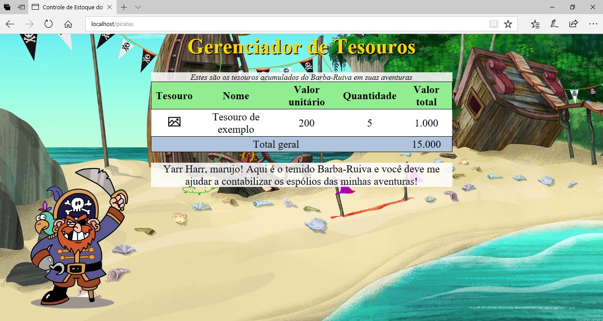
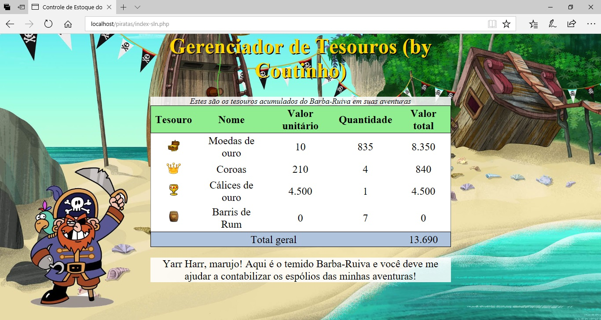

<!-- {"layout": "section-header", "hash": "tesouros-de-piratas-dinamicos"} -->
# Piratas Dinâmicos
## Barba-Ruiva + Apache, PHP e MySQL

- Instalando Apache, PHP e MySQL
- Atividade de hoje
<!-- {ul:.content} -->

---
<!-- {"backdrop": "piratas-php"} -->

---
## Instalando Apache, PHP e MySQL

- **<u>Pergunte ao professor</u> se é necessário instalar algo** nos
  laboratórios
  - É provável que já esteja tudo funcionando... de qualquer forma, leia sobre
    como fazê-lo
- Podemos instalar (a) cada software separadamente ou (b) um pacote que
  instala todos de uma vez _(mais fácil)_
  - (a) Visite os sites oficiais: [Apache][apache], [MySQL][mysql], [PHP][php]
  - (b) [WAMP][wamp] (para Windows), [LAMP][lamp] (para Linux)
    ou [XAMPP][xampp] (ambos)
- Ao instalar, lembre-se apenas de **<u>anotar o usuário</u> (normalmente
  'root') <u>e senha</u> escolhidos para o MySQL**

*[WAMP]: Windows, Apache, MySQL e PHP*
*[LAMP]: Linux, Apache, MySQL e PHP*

[apache]: https://httpd.apache.org/download.cgi
[mysql]: https://www.mysql.com/downloads/
[php]: http://php.net/downloads.php
[wamp]: http://www.wampserver.com/en/
[lamp]: https://howtoubuntu.org/how-to-install-lamp-on-ubuntu
[xampp]: https://www.apachefriends.org/pt_br/index.html

---
<!-- {"layout": "2-column-content"} -->
## Atividade de hoje

 <!-- {.full-width} -->

 <!-- {.full-width} -->

- Torne a página dos tesouros do Barba-Ruiva uma página dinâmica usando
  o Apache, PHP e um banco de dados MySQL <!-- {ul:.span-columns} -->
- Veja o [enunciado completo][enunciado-pirates] no Github

[enunciado-pirates]: https://github.com/fegemo/cefet-front-end-pirates/tree/master-php